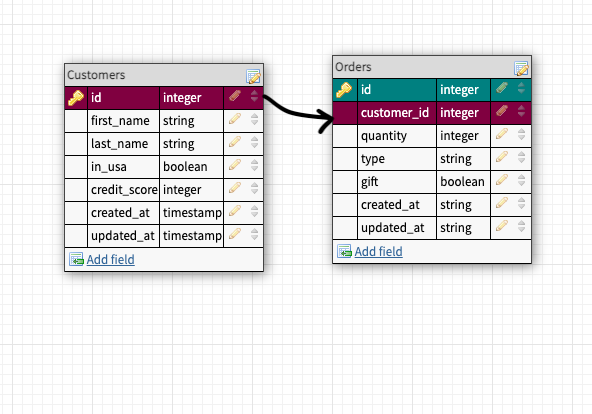

# README #

# The schema for this database follows the following photo:
 

These directions will get this application up & running.

1. Make sure you are using Ruby Version 2.7.4
2. Be sure to use Rails version 5.2.8
3. Run db:migrate from the terminal.
4. This App lets you create the database of customers & orders. 
The customers in_usa field must be true or false and the orders gift input must be true or false.
5. To run the tests go to the Gemfile and under the group:development, :test do
add gem 'simplecov'
 gem 'rspec-rails'
 gem 'orderly'
 then run bundle install from the terminal.

